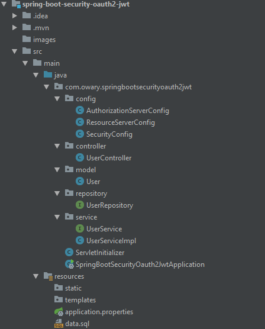

# Steps:

Structure



#### Dependencies
- spring-boot-starter-security
- spring-boot-starter-web
- spring-boot-starter-data-jpa
- spring-cloud-starter-oauth2
- h2
- lombok

## Security Configurations
### Create an AuthorizationServerConfig in /config package that extends AuthorizationServerConfigurerAdapter

```
    public void configure(ClientDetailsServiceConfigurer clients) throws Exception {
        clients
                .inMemory()
                // the client id
                .withClient(CLIENT_ID)
                // the secret, if any
                .secret(CLIENT_SECRET)
                // grant types
                .authorizedGrantTypes(GRANT_TYPE_PASSWORD, AUTHORIZATION_CODE, REFRESH_TOKEN, IMPLICIT)
                // what are the scopes, if none then user won't be limited to any scope
                .scopes(SCOPE_READ, SCOPE_WRITE, TRUST)
                // validity of the token
                .accessTokenValiditySeconds(ACCESS_TOKEN_VALIDITY_SECONDS)
                // refresh token validity
                .refreshTokenValiditySeconds(REFRESH_TOKEN_VALIDITY_SECONDS);
    }
```
- Here scopes are simply contract between AuthenticationServer and ResourceServer. They can be anything. They are akin to Spring Security's User Roles. Based on them we can make some evaluations like forbidding the users to delete a resource if they have no 'delete' scope.

- Grant Types on [OAuth Website](https://oauth.net/2/grant-types/), [AlexBilbie](https://alexbilbie.com/guide-to-oauth-2-grants/), [Okta on Implicit Type](https://developer.okta.com/blog/2018/05/24/what-is-the-oauth2-implicit-grant-type), [Okta on Authorization Code](https://developer.okta.com/blog/2018/04/10/oauth-authorization-code-grant-type)

- `AuthorizationServerEndpointsConfigurer` actually supports all the grant types, except passwords. To enable this ability, `AuthenticationManager` is injected

```
    public void configure(AuthorizationServerEndpointsConfigurer endpoints) throws Exception {
        endpoints
                // persistence of tokens
                .tokenStore(tokenStore)
                // to support passwords as well
                .authenticationManager(authenticationManager);
    }
```

### Create a ResourceServerConfig in /config package that extends ResourceServerConfigurerAdapter
A Resource Server (can be the same as the Authorization Server or a separate application) serves resources that are protected by the OAuth2 token. Spring OAuth provides a Spring Security authentication filter that implements this protection. You can switch it on with `@EnableResourceServer` on an `@Configuration` class, and configure it (as necessary) using a `ResourceServerConfigurer`.

```
    public void configure(ResourceServerSecurityConfigurer resources) throws Exception {
        resources
                .resourceId(RESOURCE_ID)
                .stateless(false);
    }

    public void configure(HttpSecurity http) throws Exception {
        http
                // disable anonymous access
                .anonymous().disable()
                // authorize the request
                .authorizeRequests()
                // make sure the users are authenticated in given link
                .antMatchers("/users/**").authenticated()
                .and()
                // delegate handling exception to OAuth2
                .exceptionHandling().accessDeniedHandler(new OAuth2AccessDeniedHandler());
    }
``` 

### SecurityConfig in /config package that extends WebSecurityConfigurerAdapter
Explanation on `@EnableGlobalMethodSecurity(prePostEnabled = true)` annotation. This annotation enables AOP security. So by setting `prePostEnabled=true` we enable `@PreAuthorize` and `@PostAuthorize` annotations which lets us to perform security on method level. For more info check [here](http://websystique.com/spring-security/spring-security-4-method-security-using-preauthorize-postauthorize-secured-el/)

```
    @Autowired
    @Qualifier("userService")
    private UserDetailsService userDetailsService;

    @Autowired
    public void globalUserDetails(AuthenticationManagerBuilder authBuilder) throws Exception{
        authBuilder
                .userDetailsService(userDetailsService) 
                .passwordEncoder(bCryptPasswordEncoder()); 
    }

    @Override
    protected void configure(HttpSecurity http) throws Exception {
        http
                .csrf().disable()
                .anonymous().disable()
                .authorizeRequests()
                .antMatchers("/api-docs/**").permitAll();
    }

```
## Service Layer

### User Service
User Service is a regular service class that has nothing fancy

```
public interface UserService{

    User save(User user);
    List<User> findAll();
    void deleteById(Long id);

}
```

### User Service Implementation Class
Here `UserService` is our service layer interface, but `UserDetailsService` is the class provided by Spring Security. By implementing it, we have to also override `UserDetails loadUserByUsername(String username)` method as well 
```
@Service("userService")
public class UserServiceImpl implements UserDetailsService, UserService{
    
    // Autowirings...
    
    @Override
    public UserDetails loadUserByUsername(String username) throws UsernameNotFoundException {
        User user = repository.findUserByUsername(username).orElseThrow(() -> new UsernameNotFoundException("User with provided username doesn't exist"));
        UserDetails userDetails = new org.springframework.security.core.userdetails.User(user.getUsername(), user.getPassword(), getAuthority());
        return userDetails;
    }

    private List<SimpleGrantedAuthority> getAuthority(){
        return asList(new SimpleGrantedAuthority("ROLE_ADMIN")); // as for demo everyone's assined an Admin role
    }
    
    // User Service methods implemented ... 
    
}
```

## Model

### Model class is so simple
This is the User class that is managed by us, not the Spring provided one
```
@Entity
@Data
public class User {

    @Id
    @GeneratedValue(strategy = GenerationType.IDENTITY)
    private Long id;

    @Column
    private String username;

    @Column
    @JsonIgnore
    private String password;

    @Column
    private long salary;

    @Column
    private int age;

}
```

## Controller
Controller is a `@RestController` that has the following methods

```
    @GetMapping("/user")
    public List listUser();

    @PostMapping("/user")
    public User create(@RequestBody User user);

    /**
     * Here @PreAuthorize annotation simply does the following
     * If the authorized user has no scope of 'delete', simply cannot use the method
     */
    @PreAuthorize("#oauth2.hasScope('delete')")
    @DeleteMapping(value = "/user/{id}")
    public String delete(@PathVariable(value = "id") Long id);
```

## Testing in POSTMAN
#### Getting Token
 - Provide client id and client secret


- Provide credentials and grant type


- Later on each request we'll also append access_token to the request URL

#### GET Request Example


#### POST Request Example


#### DELETE Request Example
here it won't let us delete because the current user has no scope for deleting 


Tutorial from [here](https://www.devglan.com/spring-security/spring-boot-security-oauth2-example) is followed